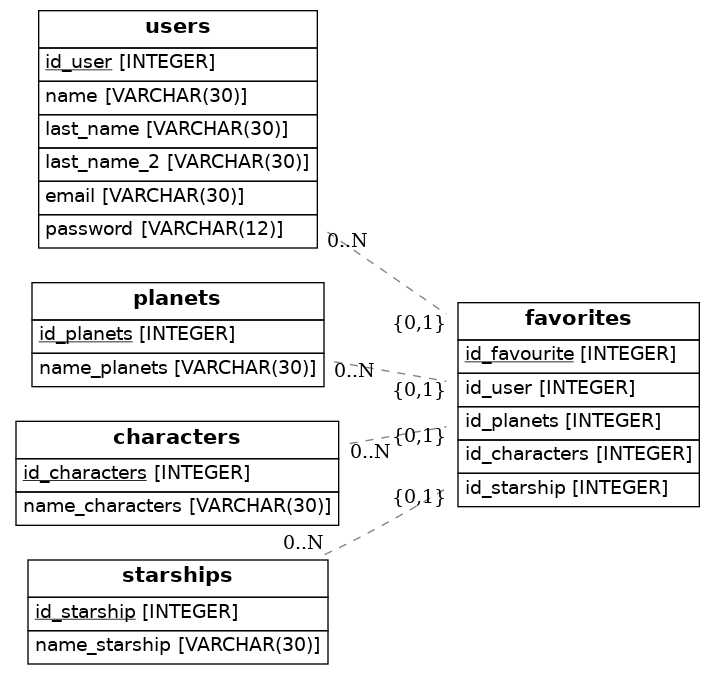

# StarWars blog database

**Important**: Para realizar esta actividad necesitas hacer un  `fork` de este repo en tu cuenta de **Github** Github y luego, abrir el fork en Gitpod.

Dentro del archivo `src/models.py` encontrarás un par de clases que describen una base de datos de ejemplo.

Vamos a crear el Diagrama de relación de entidad para la base de datos de un blog de StarWars, un diagrama muy similar a este:

[Click to open diagram](https://app.quickdatabasediagrams.com/#/d/LxNXQZ)

> 🔥 You can use this FREE tool to practice your diagram for the first time: https://app.quickdatabasediagrams.com/#/d/

## 💻 Instalación

1. Entra dentro del environmen `$ pipenv shell`

2. Instala todas las dependencias `$ pipenv install`

3. Genera el diagrama tantas veces como sea necesario `$ python src/models.py`

4. Abre el archivo `diagram.png` para ver tu diagrama UML!

## 📝Instrucciones

Tu trabajo es actualizar el archivo `src/models.py` con el código necesario para replicar el modelo de datos de un blog de StarWars

El proyecto está utilizando la librería Python SQLAlchemy para generar la base de datos.

- Tu proyecto debe tener una tabla `Usuario` que va a contener la información de cada uno de tus usuarios.
- Los usuarios del blog podrán iniciar sesión y guardar sus planetas o personajes favoritos.
- Tu base de datos debe guardar los favoritos de cada usuario del blog para su posterior revisión.
- Tu base de datos también debe almacenar cada planeta y personaje de starwars.
- ¿Qué otras tablas crees que necesitarás para tu aplicación?
- ¿Qué propiedades deben ir dentro de cada tabla? Por ejemplo: El usuario tiene email, password, fecha de subscripción, nombre, apellido, etc.
- ¿Qué relaciones hay entre las tablas? ¿Cuántos planetas puede guardar un usuario?Nota: Recuerda que las relaciones pueden ser Uno-a-uno, Uno-a-muchos o Muchos-a-muchos.
- Porfavor agrega por lo menos 4 modelos y sus respectivas relaciones.
- Genera el`diagram.png` utilizando el comando `$ python3 models.py` en la consola.

## Sobre el proyecto

Finalmente he creado 5 tablas que son:
1) Usuarios: como propiedades he metido el nombre, apellidos, e-mail y contraseña.
2) Personajes: Tanto en esta tabla como en las 2 de abajo como propiedad puse solo el nombre.
3) Planetas
4) Vehículos
5) Favoritos : recibe las FK del resto de tablas.

